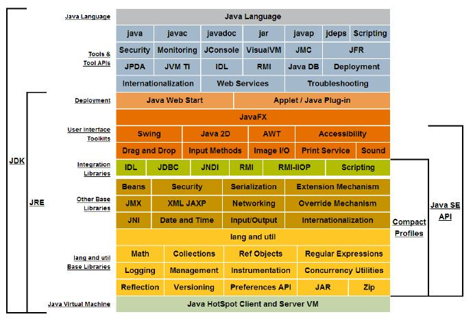

# Java 基础教程

JAVA

    

## Java 简介

Java 是由 Sun Microsystems 公司于 1995 年推出的一门面向对象程序设计语言。2010 年 Oracle 公司收购 Sun Microsystems，之后由 Oracle 公司负责 Java 的维护和版本升级。 
其实，Java 还是一个平台。Java 平台由 Java 虚拟机（Java Virtual Machine，JVM）和 Java 应用编程接口（Application Programming Interface，API）构成。Java 应用编程接口为此提供了一个独立于操作系统的标准接口，可分为基本部分和扩展部分。在硬件或操作系统平台上安装一个 Java 平台之后，Java 应用程序就可运行。 
Java 平台已经嵌入了几乎所有的操作系统。这样 Java 程序只编译一次，就可以在各种系统中运行。

::: details <b> 3 个体系：Java SE、Java EE、Java ME</b>

 

     
    
<b>1. Java SE的体系结构</b>

- #### Java SE （Java Platform Standard Edition，Java 平台标准版）

`Java SE` 又称为 J2SE，它允许开发和部署在桌面、服务器、嵌入式环境和实时环境中使用的 Java 应用程序。Java SE 包含了支持 Java Web 服务开发的类，并为 Java EE 提供基础，如 Java 语言基础、JDBC 操作、I/O 操作、网络通信以及多线程等技术。

- #### Java EE （Java Platform Enterprise Edition，Java 平台企业版）

`Java EE` 又称为 J2EE。企业版本帮助开发和部署可移植、健壮、可伸缩且安全的服务器端 Java 应用程序。Java EE 是在 Java SE 基础上构建的，它提供 Web 服务、组件模型、管理和通信 API，可以用来实现企业级的面向服务体系结构（Service Oriented Architecture，SOA）和 Web 2.0 应用程序。

- #### Java ME （Java Platform Micro Edition，Java 平台微型版）

`Java ME` 又称为 J2ME，也叫 K-JAVA。 Java ME 为在移动设备和嵌入式设备（比如手机、PDA、电视机顶盒和打印机）上运行的应用程序提供一个健壮且灵活的环境。

:::

::: details <b>2. Java 语言的特点</b>

<b>Java语言的特点</b>

- #### 面向对象

> Java 是一种面向对象的语言，它对对象中的类、对象、继承、封装、多态、接口、包等均有很好的支持。为了简单起见，Java 只支持类之间的单继承，但是可以使用接口来实现多继承。使用 Java 语言开发程序，需要采用面向对象的思想设计程序和编写代码。

- #### 平台无关性

> 平台无关性的具体表现在于，Java 是“一次编写，到处运行（Write Once，Run any Where）”的语言，因此采用 Java 语言编写的程序具有很好的可移植性，而保证这一点的正是 Java 的虚拟机机制。在引入虚拟机之
> 后，Java 语言在不同的平台上运行不需要重新编译。 
> Java 语言使用 Java 虚拟机机制屏蔽了具体平台的相关信息，使得 Java 语言编译的程序只需生成虚拟机上的目标代码，就可以在多种平台上不加修改地运行。

- #### 简单性

> Java 语言的语法与 C 语言和 C++ 语言很相近，使得很多程序员学起来很容易。对 Java 来说，它舍弃了很多 C++ 中难以理解的特性，如操作符的重载和多继承等，而且 Java 语言不使用指针，加入了垃圾回收机制，>
> 解决了程序员需要管理内存的问题，使编程变得更加简单。

- #### 解释执行

> Java 程序在 Java 平台运行时会被编译成字节码文件，然后可以在有 Java 环境的操作系统上运行。在运行文件时，Java 的解释器对这些字节码进行解释执行，执行过程中需要加入的类在连接阶段被载入到运行环境中。

- #### 多线程

> Java 语言是多线程的，这也是 Java 语言的一大特性，它必须由 Thread 类和它的子类来创建。Java 支持多个线程同时执行，并提供多线程之间的同步机制。任何一个线程都有自己的 run() 方法，要执行的方法就写
> 在 run() 方法体内。

- #### 分布式

> Java 语言支持 Internet 应用的开发，在 Java 的基本应用编程接口中就有一个网络应用编程接口，它提供了网络应用编程的类库，包括 URL、URLConnection、Socket 等。Java 的 RIM 机制也是开发分布式应用的重要手段。

- #### 健壮性

> Java 的强类型机制、异常处理、垃圾回收机制等都是 Java 健壮性的重要保证。对指针的丢弃是 Java 的一大进步。另外，Java 的异常机制也是健壮性的一大体现。

- #### 高性能

> Java 的高性能主要是相对其他高级脚本语言来说的，随着 JIT（Just in Time）的发展，Java 的运行速度也越来越高。

- #### 安全性

> Java 通常被用在网络环境中，为此，Java 提供了一个安全机制以防止恶意代码的攻击。除了 Java 语言具有许多的安全特性以外，Java 还对通过网络下载的类增加一个安全防范机制，分配不同的名字空间以防替代本地的同名类，并包含安全管理机制。

:::

::: details <b>3. Java 编码规范(命名规则)</b>

**编程规范**是对编程的一种约定，主要作用是增强代码的`可读性`和`可维护性`，便于代码重用。

首先要求程序中的各个要素都遵守命名规则，然后在编码中严格按照编码格式编写代码。命名规则包括以下几点。
- `包的名称`：由一个**小写字母**序列组成。
- `类的名称`：由**大写字母开头**，**其他字母都由小写**的单词组成。
- `类的实例的名称`：由一个**小写字母开头**，后面的单词由**大写字母开头**。
- `常量的名称`：都**大写**，并且指出完整含义。
- `参数的名称`：无其他具体规定。
- `数组的命名`：使用**类型[] 数组名**的形式。
`
:::
