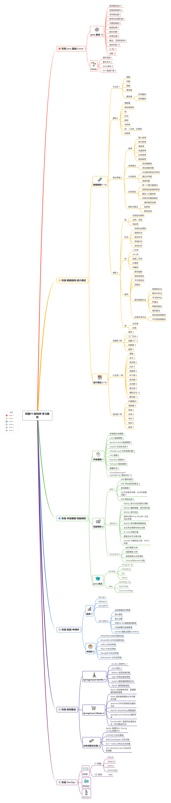
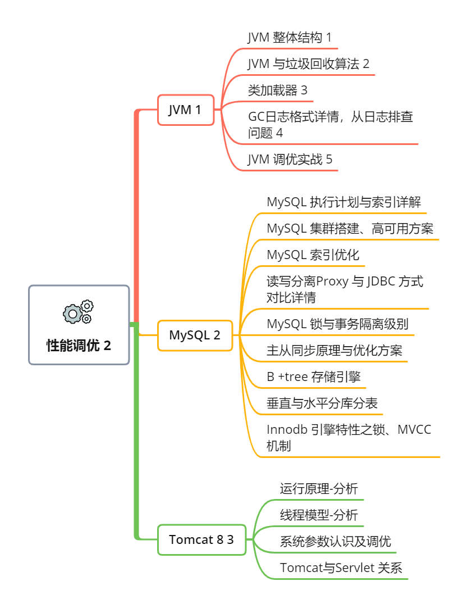

# Java 架构师-学习路线

  Java 架构师-学习路线
   
   
  

---

## 阶段一 Java 基础/Linux

  

### [**Java 基础教程**](../base/java/00-java-introduce)

-  第一章 编码规范 
-  第二章 流程控制语句 
-  第三章 字符串处理 
-  第四章 数字和日期处理 
-  第五章 内置包装类 
-  第六章 数组处理 
-  第七章 面向对象 
-  第八章 异常处理 
-  第九章 集合、泛型和枚举 
-  第十章 反射机制 
-  第十一章 IO 流 
-  第十二章 注解 

---

  

### [**Linux 基础教程**](../base/linux/00-linux-introduce)

- 第一章 操作系统
- 第二章 基本命令
- 第三章 shell 脚本
- 第四章 lvm 磁盘扩容

---

## 阶段二 数据结构/设计模式

  

### [**数据结构 教程**](../advanced/data/00-data-introduce)

- 第一章 方法论
- 第二章 基础
  - 增删查
  - 线性表结构
  - 栈
  - 队列
  - 数组
  - 字符串
  - 树、二叉树、红黑树
  - 哈希表
- 第三章 算法思维
  - 递归
  - 分治
  - 排序
  - 动态规划

---

### [**23设计模式 教程**](../advanced/design/00-design-introduce)

  

- 第一章 创建型 5种
  - 单例 1
  - 工厂方法 2
  - 抽象工厂 3
  - 构建者 4
  - 原型 5
- 第二章 行为型 11种
  - 策略 1
  - 命令 2
  - 责任链 3
  - 状态 4
  - 观察者 5
  - 中介者 6
  - 迭代器 7
  - 访问者 8
  - 备忘录 9
  - 模板方法 10
  - 解析器 11
- 第三章 结构型 7种
  - 代理模式 1
  - 适配器 2
  - 桥接 3
  - 外观 4
  - 亨元 5
  - 组合 6
  - 装饰 7

---

### [**Java 集合源码分析**](../high/collection/00-collection-introduce.md)

  

- 第一章 Iterable 集合
  - ArrayList
  - LinkedList
  - Vector
  - Set

- 第二章 Map 集合
  - HashMap
  - CourrentMap
  - HashTable

## 阶段三 并发编程/性能调优

  

### [**并发编程**](../high/concurrent/00-concurrent-introduce)

- 多线程生命周期
- Lock 底层原理
- Synchronized 底层原理
- volatile 可见性本质
- Thread Local 内存泄漏问题
- CAS 原理
- Executor 线程池
- Fork-join 框架原理
- 阻塞队列
- CountDownLatch/CyclicBarrier 源码分析

---

  

### [**性能调优**](../high/performance/00-performance-introduce)

- JVM 1
- MySQL 2
- Tomcat 8 3

## 阶段四 框架/中间件

### [**框架**]()

- Mybatis 3
- Hibernate
- JPA
- Spring 5
- Spring MVC
- Spring Boot
- Spring Security
- Double

### [**中间件**]()

- RabbitMQ 分布式消息总线
- RocketMQ 分布式消息总线
- Kafka 分布式存储
- Redis 分布式存储
- MongDB 分布式存储
- Elaticsearch 分布式存储

## 阶段五 架构整合

### [**SpringCloud Netflix 1**]()

### [**SpringCloud Alibaba 2**]()

### [**分布式解决方案 3**]()

## 阶段六 DevOps

### [**CICD**]()

### [**Docker**]()

### [**Kubernetes**]() 

### [**性能调优**](../high/performance/00-performance-introduce)

- JVM
- MySQL
- Tomcat 8

---

## 阶段四 框架/中间件

### [**框架**]()

- Mybatis 3
- Hibernate
- JPA
- Spring 5
- Spring MVC
- Spring Boot
- Spring Security
- Double

---

### [**中间件**]()

- RabbitMQ 分布式消息总线
- RocketMQ 分布式消息总线
- Kafka 分布式存储
- Redis 分布式存储
- MongDB 分布式存储
- Elaticsearch 分布式存储

---

## 阶段五 架构整合

### [**SpringCloud Netflix 1**]()

### [**SpringCloud Alibaba 2**]()

### [**分布式解决方案 3**]()

## 阶段六 DevOps

### [**CICD**]()

### [**Docker**]()

### [**Kubernetes**]() 

