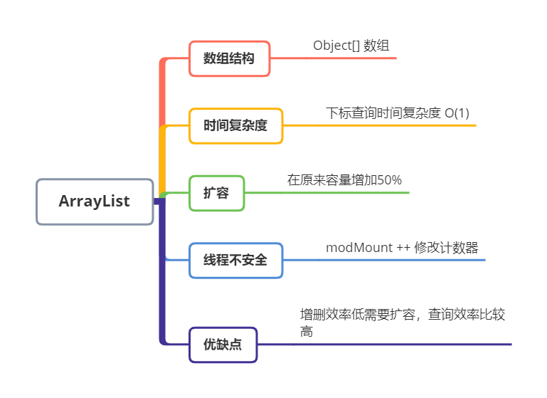
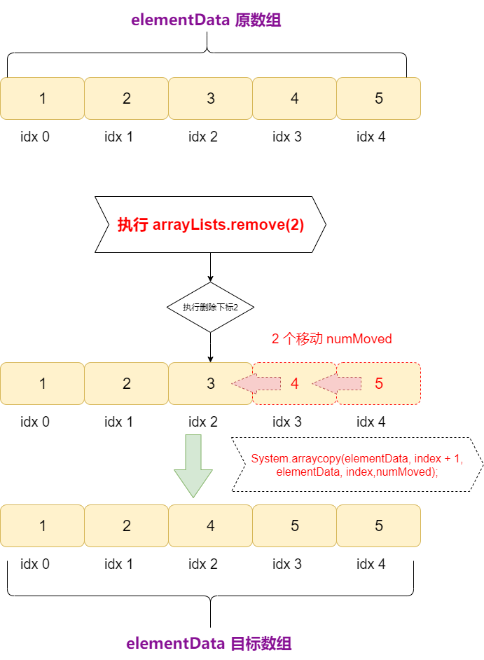

# ArrayList

<center><font size="20px" color="#3eaf7c">ArrayList 源码分析</font></center>

---

<center>
    
</center>

---

::: warning <p class=warning-title>本章学习要点</p>
- <font class=warning-inner>1. Java8 中 ArrayList 初始容量</font>
- <font class=warning-inner>2. Java8 中 ArrayList 构造函数、add方法、get方法、size方法、remove方法</font>
- <font class=warning-inner>3. Java8 中 ArrayList 中的扩容， 以及数组扩容技术： System.arraycopy</font>
- <font class=warning-inner>4. Java8 中 ArrayList 中的为什么线程不安全问题</font>
- <font class=warning-inner>5. Java8 中 ArrayList 的实现思路</font>

::: 

## 一、ArrayList 的实现思路

::: tip <p class=tip-title>实现分析思路</p>

* <font class=tip-inner>1. 查看构造函数。</font>

* <font class=tip-inner>2. 添加数组元素方法。</font>

  * 数组扩容
  * 元素和数组下标绑定（赋值）

* <font class=tip-inner>3. 查询数组方法</font>

* <font class=tip-inner>4. 获取数组大小方法</font>

* <font class=tip-inner>5. 删除数组方法</font>

  - 检查数组是否越界
  -  获取删除数组元素
  - 计算需要移动数组元素的个数（将删除元素后的位置，往前面移动）

  - 判断移动的个数是否大于0
  - 删除最后一个元素，设置为null，并且数组size大小-1

::: 

## 二、构造函数

```java
public class ArrayList<E> extends AbstractList<E>
        implements List<E>, RandomAccess, Cloneable, java.io.Serializable
{ 
    private static final long serialVersionUID = 8683452581122892189L;

    /**
     * 数组默认为空数组
     */
    private static final Object[] DEFAULTCAPACITY_EMPTY_ELEMENTDATA = {};

    /**
     * transient: 不能够被序列化
     * 用于存放元素
     */
    transient Object[] elementData;

    /**
     * 数组容量默认初始值为0
     */
    private int size;

    /**
     * 数组默认容量为10
     */
    private static final int DEFAULT_CAPACITY = 10;

    /**
     * Integer 最大值 21亿 - 8
     */
    private static final int MAX_ARRAY_SIZE = Integer.MAX_VALUE - 8;

    /**
     *
     * 修改的次数，作用：使用fail-fast机制，为了解决集合结构发生变化时候，快速失败机制
     */
    protected transient int modCount = 0;

    /**
     * 构造方法是一个空集合，初始容量为10
     */
    public ArrayList() {
        this.elementData = DEFAULTCAPACITY_EMPTY_ELEMENTDATA;
    }
	...
}
```

::: details <font class=details-title> 构造函数  ->  分析结论：</font>

### 1. ArrayList 底层通过 Object[] 数组来实现的。

```java
    /**
     * 数组默认为空数组
     */
    private static final Object[] DEFAULTCAPACITY_EMPTY_ELEMENTDATA = {};
```

### 2. 当我们进行 `new ArrayList()`创建一个集合时，集合为空数组。

 ```java
    /**
     * 构造方法是一个空集合，初始容量为10
     */
    public ArrayList() {
        this.elementData = DEFAULTCAPACITY_EMPTY_ELEMENTDATA;
    }
 ```
:::

## 三、add方法

```java
@Override
public boolean add(E e) {
    // 第一步: 当前数组为空数组，需要扩容。
    ensureCapacityInternal(size + 1);
    // 第二步：给元素指定到数组指定下标位置。（第一次 size++ 添加元素size为0后， size值为1)
    elementData[size++] = e;
    return true;
 }

/**
 * 确保（ensure）内部容量
 *
 * @param minCapacity 最小初始容量
 */
private void ensureCapacityInternal(int minCapacity) {
    // 第一次: 当数组为空数组时，给数组初始容量为10.
    if (elementData == DEFAULTCAPACITY_EMPTY_ELEMENTDATA) {
        // max函数是三目运算符比较
        minCapacity = Math.max(DEFAULT_CAPACITY, minCapacity);
    }
    // 数组扩容
    ensureExplicitCapacity(minCapacity);
 }

/**
 * 确保明确(Explicit)的容量
 *
 * @param minCapacity 最小初始容量
 */
private void ensureExplicitCapacity(int minCapacity) {
    modCount ++;
    // 第一次: 如果 10-0 > 0，为TRUE
    if (minCapacity - elementData.length > 0) {
        // 数组扩容
        grow(minCapacity);
    }
}
```

::: details <font class=details-title> add方法 ->  分析结论：</font>

### 1. 当我们使用add方法时，底层实现思路 -> 1扩容、2绑定。

- #### 第一步：判断是否需要进行扩容

  ```java
      // 第一步: 当前数组为空数组，需要扩容。
      ensureCapacityInternal(size + 1);
  ```

  

- #### 第二步：数组下标与元素进行绑定（赋值）

  ```java
      // 第二步：给元素指定到数组指定下标位置。（第一次 size++ 添加元素size为0后， size值为1)
      elementData[size++] = e;
  ```

### 2. 第一次扩容为10个容量，超过10个元素后，扩容后数组在原来容量增加的50%。

- #### 第一次为空的数组，添加第一个时候。

  ```java
  // 第一次: 当数组为空数组时，给数组初始容量为10.
  if (elementData == DEFAULTCAPACITY_EMPTY_ELEMENTDATA) {
      // max函数是三目运算符比较
      minCapacity = Math.max(DEFAULT_CAPACITY, minCapacity);
  }
  ```

- #### 超过10个元素后，扩容后数组在原来容量增加的50%。

  ```java
  /**
   * 扩容
   *
   * @param minCapacity 最小初始容量
   */
  private void grow(int minCapacity) {
      // 第一次：旧的数组容量 = 数组元素.长度 (0)
      int oldCapacity = elementData.length;
      // 第一次：新的数组容量 = 0 +（0 >> 1）0/2 = 0
      int newCapacity = oldCapacity + (oldCapacity >> 1);
      // 第一次：0-10 < 0
      if (newCapacity - minCapacity < 0)
          // 第一次：新的数组容量为 = 10
          newCapacity = minCapacity;
      // 否则，不是第一次，如果添加的新的数组容量，超过Ingter。最大值（21亿 - 8），执行hugeCapacity         (巨大容量) 方法    
      if (newCapacity - MAX_ARRAY_SIZE > 0)
          newCapacity = hugeCapacity(minCapacity);
      /* 通过Arrays.copyOf对数组进行扩容
       * - copyOf 方法将旧的数组元素，放入到新的数组中。
       * - 但是，扩容后数组有些下标为 null.
       */
      elementData = Arrays.copyOf(elementData, newCapacity);
  }
  ```

  - 重点: 计算公式： `oldCapacity + (oldCapacity >> 1);`  原来容量增加的50%

    ```java
    // 第一次：新的数组容量 = 0 +（0 >> 1）0/2 = 0
    int newCapacity = oldCapacity + (oldCapacity >> 1);
    ```

### 3. grow 扩容方法, 使用到的技术Arrays.copyOf方法, 将旧的数组元素，放入到新的数组中。

```java
 /* 通过Arrays.copyOf对数组进行扩容
  * - copyOf 方法将旧的数组元素，放入到新的数组中。
  * - 但是，扩容后数组有些下标为 null.
  */
 elementData = Arrays.copyOf(elementData, newCapacity);
```

:::

## 四、get方法

```java
@Override
public E get(int index) {
   // 根据下标从数组中查询指定的元素，因为数组的查询效率 O(1)
   return (E) elementData[index];
}
```

::: details <font class=details-title> get方法 ->  结论：</font>

### 1. 根据下标从数组中查询指定的元素，所以时间复杂度为 O(1)

:::

## 五、size方法

```java
@Override
public int size() {
    // size 只表示赋值后的数组长度，不代表容量的真实数组长度。
    return size;
}
```

::: details <font class=details-title> size方法 ->  分析结论：</font>

### 1. size 只表示`赋值后`的数组长度，不代表数组容量长度。

```java
/** 测试代码 **/ 
ArrayList<String> extArrayList = new ArrayList<>();
// 第一次：添加数组 1
extArrayList.add("元素1");
// 第一次：测试，获取数组元素方法
System.out.println(extArrayList.get(0));
// 第一次：测试，获取数组大小方法
System.out.println("ArrayList 数组的大小：" + extArrayList.size());
// 第一次：测试，获取数组大小方法
System.out.println("ArrayList 数组容量的大小：" + extArrayList.elementData.length);
```

```verilog
元素1
ArrayList 数组的大小：1
ArrayList 数组容量的大小：10
```

:::

## 六、remove方法

```java
@Override
public E remove(int index) {
    // 第一步：检查数组是否越界
    rangeCheck(index);

    modCount ++;

    // 第二步： 获取删除数组元素
    E oldValue = get(index);
    // 第三步：计算需要移动数组元素的个数（将删除元素后的位置，往前面移动）
    int numMoved = size - index - 1;
    // 第四步： 移动数组元素的个数 > 0 （判断移动的个数是否大于0）
    if (numMoved > 0) {
        // 将删除元素(index)后的一个元素(index+1)覆盖删除元素，将移动数组元素的个数往前移动（重新计算删除元素后需要移动数组元素个数的位置）。
        /**
         * elementData 源数组
         * index + 1 原数组要复制的起始位置
         * elementData 目标数组
         * index 目标数组要放置的起始位置
         * numMoved 复制长度
         */
        System.arraycopy(elementData, index + 1, elementData, index,
                numMoved);
    }
    // 第五步：删除最后一个元素，设置为null，并且数组大小-1
    elementData[--size] = null; // clear to let GC do its work
    return oldValue;
}
```

::: details <font class=details-title> remove方法 -> 分析结论：</font>

### 1. remove 实现思路

- 第一步：检查数组是否越界
- 第二步： 获取删除数组元素
- 第三步：计算需要移动数组元素的个数（将删除元素后的位置，往前面移动）

- 第四步：判断移动的个数是否大于0
- 第五步：删除最后一个元素，设置为null，并且数组size大小-1

### 2. arraycopy 方法，将删除元素(index)后的一个元素(index+1)覆盖删除元素，将移动数组元素的个数往前移动（重新计算删除元素后需要移动数组元素个数的位置）。

```java
// 将删除元素(index)后的一个元素(index+1)覆盖删除元素，将移动数组元素的个数往前移动
//（重新计算删除元素后需要 移动数组元素个数的位置）。
/**
 * elementData 源数组
 * index + 1 原数组要复制的起始位置
 * elementData 目标数组
 * index 目标数组要放置的起始位置
 * numMoved 复制长度
 */
System.arraycopy(elementData, index + 1, elementData, index,numMoved);
    
```

<center>
    
</center>

:::

## 七、modCount修改次数的作用

- 出现在 `add`方法中`ensureExplicitCapacity`方法的和`remove`删除方法

```java
 /**
  * 确保明确(Explicit)的容量
  *
  * @param minCapacity 最小初始容量
  */
 private void ensureExplicitCapacity(int minCapacity) {
     modCount ++;
     // 第一次: 如果 10-0 > 0，为TRUE
     if (minCapacity - elementData.length > 0) {
         // 数组扩容
         grow(minCapacity);
     }
 }
```

```java
@Override
public E remove(int index) {
    // 第一步：检查数组是否越界
    rangeCheck(index);
    modCount ++;
    // 第二步： 获取删除数组元素
    E oldValue = get(index);
    // 第三步：计算需要移动数组元素的个数（将删除元素后的位置，往前面移动）
    int numMoved = size - index - 1;
    // 第四步： 删除后的后一位设置元素 > 0
    if (numMoved > 0) {
        // 将删除元素(index)后的一个元素(index+1)覆盖删除元素，将移动数组元素的个数往前移动（重新计算删除元素后需要移动数组元素个数的位置）。
        /**
         * elementData 源数组
         * index + 1 原数组要复制的起始位置
         * elementData 目标数组
         * index 目标数组要放置的起始位置
         * numMoved 复制长度
         */
        System.arraycopy(elementData, index + 1, elementData, index,
                numMoved);
    }
    // 第五步：删除最后一个元素，设置为null，并且数组大小-1
    elementData[--size] = null; // clear to let GC do its work
    return oldValue;
}
```

::: details <font class=details-title>modCount修改次数-> 分析结论：</font>

### 1. modCount 使用fail-fast机制，为了解决Java 集合结构发生变化时候，快速失败机制。

### 2. modCount 作用：防止读写数据不一致，导致冲突。（线程）

- 演示 ArrayList 线程不安全问题

```java
package com.calvin.iterable;

import java.util.List;
import java.util.concurrent.CopyOnWriteArrayList;

/**
 * description: ArrayListTest
 * date: 2020/10/10 4:06
 * author: Calvin
 * version: 1.0
 */
public class ArrayListTest {

    /**
     * 线程不安全
     */
    private List<String> strings = new ArrayList<String>();
    
    /**
     * 线程A
     */ 
    class ThreadA implements Runnable {

        @Override
        public void run() {
            // 1.存储数据
            for (int i = 0; i < 10; i++) {
                strings.add("i:" + i);
                // 2.打印数据
                print();
            }
        }
    }

    /**
     * 线程B
     */
    class ThreadB implements Runnable {

        @Override
        public void run() {
             // 1.存储数据
            for (int i = 10; i < 20; i++) {
                strings.add("i:" + i);
                // 2.打印数据
                print();
            }

        }
    }
    
    /**
     * 创建线程，启动线程
     */
    public void startRun() {
        new Thread(new ThreadA()).start();
        new Thread(new ThreadB()).start();
    }

    /**
     * 打印
     */
    private void print() {
        strings.forEach(t -> System.out.println("t:" + t));
    }

    public static void main(String[] args) {
      
        /**
         * 讲述 modCount 修改次数作用: fail-fast机制， 防止读写数据不一致，导致冲突。（线程）
         */
        new ArrayListTest().startRun();
    }

}
```

- 输出结果：通过 `modCount != expectedModCount` 判断防止读写数据不一致，导致冲突。（线程）

  ```java
  @Override
  public void forEach(Consumer<? super E> action) {
      Objects.requireNonNull(action);
      final int expectedModCount = modCount;
      @SuppressWarnings("unchecked")
      final E[] elementData = (E[]) this.elementData;
      final int size = this.size;
      for (int i=0; modCount == expectedModCount && i < size; i++) {
          action.accept(elementData[i]);
      }
      // 通过2个线程，如果同时在读在写同时竞争，导致读写数据不一致 modCount != expectedModCount
      if (modCount != expectedModCount) {
          throw new ConcurrentModificationException();
      }
  }
  ```

```verilog
t:i:0
t:i:10
t:i:0
t:i:0
t:i:10
t:i:1
t:i:0
t:i:1
t:i:2
t:i:3
t:i:4
t:i:5
t:i:6
t:i:7
t:i:8
t:i:0
t:i:10
t:i:1
t:i:2
t:i:3
t:i:4
t:i:5
t:i:6
t:i:7
t:i:8
t:i:9
Exception in thread "Thread-1" java.util.ConcurrentModificationException
	at java.util.ArrayList.forEach(ArrayList.java:1260)
	at com.calvin.iterable.ExtArrayListTest.print(ExtArrayListTest.java:91)
	at com.calvin.iterable.ExtArrayListTest.access$100(ExtArrayListTest.java:13)
	at com.calvin.iterable.ExtArrayListTest$ThreadB.run(ExtArrayListTest.java:116)
	at java.lang.Thread.run(Thread.java:748)
```

:::

## 八、扩展：解决线程安全问题

### CopyOnWriteArrayList 集合

```java
package com.calvin.iterable;

import java.util.List;
import java.util.concurrent.CopyOnWriteArrayList;

/**
 * description: ArrayListTest
 * date: 2020/10/10 4:06
 * author: Calvin
 * version: 1.0
 */
public class ArrayListTest {

    /**
     * 线程安全
     */
    private List<String> strings = new CopyOnWriteArrayList();
    
    /**
     * 线程A
     */ 
    class ThreadA implements Runnable {

        @Override
        public void run() {
            // 1.存储数据
            for (int i = 0; i < 10; i++) {
                strings.add("i:" + i);
                // 2.打印数据
                print();
            }
        }
    }

    /**
     * 线程B
     */
    class ThreadB implements Runnable {

        @Override
        public void run() {
             // 1.存储数据
            for (int i = 10; i < 20; i++) {
                strings.add("i:" + i);
                // 2.打印数据
                print();
            }

        }
    }
    
    /**
     * 创建线程，启动线程
     */
    public void startRun() {
        new Thread(new ThreadA()).start();
        new Thread(new ThreadB()).start();
    }

    /**
     * 打印
     */
    private void print() {
        strings.forEach(t -> System.out.println("t:" + t));
    }

    public static void main(String[] args) {
        new ArrayListTest().startRun();
    }

}
```

- 运行结果是没有报错的。

```verilog
t:i:0
t:i:10
t:i:0
t:i:10
t:i:0
t:i:10
t:i:1
t:i:0
t:i:10
t:i:1
t:i:11
t:i:0
....
```

- CopyOnWriteArrayList 集合地城通使用了 `final ReentrantLock lock = this.lock;`锁，解决了线程安全问题。