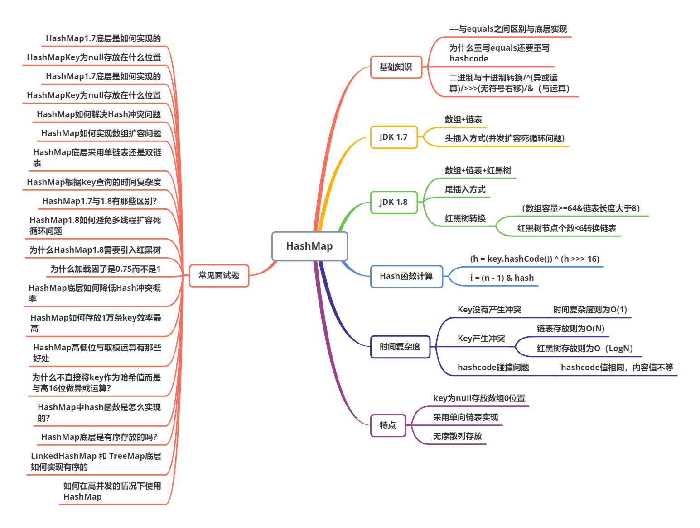

# HashMap

<center><font size="20px" color="#3eaf7c">HashMap 源码分析</font></center>

<center>
    
</center>

---

::: warning <p class=warning-title>本章学习要点</p>

- <font class=warning-inner>HashMap1.7底层是如何实现的？</font>
- <font class=warning-inner>HashMapKey为null存放在什么位置？</font>
- <font class=warning-inner>HashMap1.7底层是如何实现的？</font>
- <font class=warning-inner>HashMapKey为null存放在什么位置？</font>
- <font class=warning-inner>HashMap如何解决Hash冲突问题？</font>
- <font class=warning-inner>HashMap如何实现数组扩容问题？</font>
- <font class=warning-inner>HashMap底层采用单链表还是双链表？</font>
- <font class=warning-inner>HashMap根据key查询的时间复杂度？</font>
- <font class=warning-inner>HashMap1.7与1.8有那些区别？？</font>
- <font class=warning-inner>HashMap1.8如何避免多线程扩容死循环问题？</font>
- <font class=warning-inner>为什么HashMap1.8需要引入红黑树？</font>
- <font class=warning-inner>为什么加载因子是0.75而不是1？</font>
- <font class=warning-inner>HashMap底层如何降低Hash冲突概率？</font>
- <font class=warning-inner>HashMap如何存放1万条key效率最高？</font>
- <font class=warning-inner>HashMap高低位与取模运算有那些好处？</font>
- <font class=warning-inner>为什么不直接将key作为哈希值而是与高16位做异或运算？</font>
- <font class=warning-inner>HashMap中hash函数是怎么实现的？</font>
- <font class=warning-inner>HashMap底层是有序存放的吗？？</font>
- <font class=warning-inner>LinkedHashMap 和 TreeMap底层如何实现有序的？</font>
- <font class=warning-inner>如何在高并发的情况下使用HashMap？</font>

::: 

## 一、HashMap1.7 底层实现源码分析

### 1. 构造方法、属性、常量

```java
public class HashMap<K,V>
    extends AbstractMap<K,V>
    implements Map<K,V>, Cloneable, Serializable
{

    /**
     * 常量：初始数组容量为16 (2的幂次方)
     */
    static final int DEFAULT_INITIAL_CAPACITY = 1 << 4; // aka 16

    /**
     * 常量：最大容量为 2 ^ 30次方
     */
    static final int MAXIMUM_CAPACITY = 1 << 30;

    /**
     * 常量：默认负载因子为 0.75
     */
    static final float DEFAULT_LOAD_FACTOR = 0.75f;

    /**
     * 常量：数组 + 单链表
     */
    static final HashMap.Entry<?,?>[] EMPTY_TABLE = {};

    /**
     * 常量：加载因子
     */
    final float loadFactor;

    /**
     * 常量：扩容最大阈值 21亿
     */
    static final int ALTERNATIVE_HASHING_THRESHOLD_DEFAULT = Integer.MAX_VALUE;

    /**
     * 变量：数组：初始是一个空数组
     */
    transient HashMap.Entry<K,V>[] table = (HashMap.Entry<K,V>[]) EMPTY_TABLE;

    /**
     * 变量：这个Map中KeyValue 赋值后大小
     */
    transient int size;

    /**
     * 变量：提前扩容的阈值： 0.75 x 16 = 12
     */
    int threshold;

    /**
     * 变量：修改次数
     */
    transient int modCount;

     /**
     * 单链表
     * @param <K> 键
     * @param <V> 值
     */
    static class Entry<K,V> implements Map.Entry<K,V> {
        
        /**
         * 键
         */
        final K key;
        
        /**
         * 值
         */
        V value;
        
        /**
         * 下一个Entry
         */
        HashMap.Entry<K,V> next;

        /**
         * hash 值
         */
        int hash;

        /**
         * 创建Entry构造函数
         */
        Entry(int h, K k, V v, HashMap.Entry<K,V> n) {
            value = v;
            next = n;
            key = k;
            hash = h;
        }

        public final K getKey() {
            return key;
        }

        public final V getValue() {
            return value;
        }

        public final V setValue(V newValue) {
            V oldValue = value;
            value = newValue;
            return oldValue;
        }

        public final boolean equals(Object o) {
            if (!(o instanceof Map.Entry))
                return false;
            Map.Entry e = (Map.Entry)o;
            Object k1 = getKey();
            Object k2 = e.getKey();
            if (k1 == k2 || (k1 != null && k1.equals(k2))) {
                Object v1 = getValue();
                Object v2 = e.getValue();
                if (v1 == v2 || (v1 != null && v1.equals(v2)))
                    return true;
            }
            return false;
        }

        public final int hashCode() {
            return Objects.hashCode(getKey()) ^ Objects.hashCode(getValue());
        }

        public final String toString() {
            return getKey() + "=" + getValue();
        }
    }
    
    /**
     * 构造函数：默认初始阈值为16，加载因子为0.75
     */
    public HashMap() {
        this(DEFAULT_INITIAL_CAPACITY, DEFAULT_LOAD_FACTOR);
    }
    
    /**
     * 有参构造函数
     *
     * @param initialCapacity 初始容量为16
     * @param loadFactor 加载因子为0.75
     */
    public HashMap(int initialCapacity, float loadFactor) {
        if (initialCapacity < 0)
            throw new IllegalArgumentException("Illegal initial capacity: " +
                                               initialCapacity);
        if (initialCapacity > MAXIMUM_CAPACITY)
            initialCapacity = MAXIMUM_CAPACITY;
        if (loadFactor <= 0 || Float.isNaN(loadFactor))
            throw new IllegalArgumentException("Illegal load factor: " +
                                               loadFactor);
        // 加载因子为0.75
        this.loadFactor = loadFactor;
         // 阈值为16
        threshold = initialCapacity;
        init();
    }
    
    void init() {
    }
}
```

::: details <font class=details-title> 构造函数  ->  分析结论：</font>

- #### 1.7 HashMap 底层通过`数组+ 单链表`实现

  ```java
      /**
       * 常量：数组 + 单链表
       */
      static final HashMap.Entry<?,?>[] EMPTY_TABLE = {};
  ```

  ```java
      /**
       * 单链表
       * @param <K> 键
       * @param <V> 值
       */
      static class Entry<K,V> implements Map.Entry<K,V> {
          
          /**
           * 键
           */
          final K key;
          
          /**
           * 值
           */
          V value;
          
          /**
           * 下一个Entry
           */
          HashMap.Entry<K,V> next;
  
          /**
           * hash 值
           */
          int hash;
  
          /**
           * 创建Entry构造函数
           */
          Entry(int h, K k, V v, HashMap.Entry<K,V> n) {
              value = v;
              next = n;
              key = k;
              hash = h;
          } .....
  ```

- #### 1.7 HashMap 默认初始阈值为16，加载因子为0.75

  ```java
      
      /**
       * 常量：初始数组容量为16 (2的幂次方)
       */
      static final int DEFAULT_INITIAL_CAPACITY = 1 << 4; // aka 16
      
      /**
       * 常量：默认负载因子为 0.75
       */
      static final float DEFAULT_LOAD_FACTOR = 0.75f;
  
      /**
       * 构造函数：默认初始阈值为16，加载因子为0.75
       */
      public HashMap() {
          this(DEFAULT_INITIAL_CAPACITY, DEFAULT_LOAD_FACTOR);
      }
      
      /**
       * 有参构造函数
       *
       * @param initialCapacity 初始容量为16
       * @param loadFactor 加载因子为0.75
       */
      public HashMap(int initialCapacity, float loadFactor) {
          if (initialCapacity < 0)
              throw new IllegalArgumentException("Illegal initial capacity: " +
                                                 initialCapacity);
          if (initialCapacity > MAXIMUM_CAPACITY)
              initialCapacity = MAXIMUM_CAPACITY;
          if (loadFactor <= 0 || Float.isNaN(loadFactor))
              throw new IllegalArgumentException("Illegal load factor: " +
                                                 loadFactor);
          // 加载因子为0.75
          this.loadFactor = loadFactor;
           // 阈值为16
          threshold = initialCapacity;
          init();
      }
  ```

:::

### 2. put 方法

```java
    /**
     * 常用方法：添加键值对
     *
     * @param key   键
     * @param value 值
     * @return 值
     */
    public V put(K key, V value) {
        // 第一步: 初始数组容量 16、阈值 12
        if (table == EMPTY_TABLE) {
            // 第一次 threshold 传入的阈值为 16
            inflateTable(threshold);
        }
        // 第二步：判读如果传入key为null，存入到第0个下标数组中
        if (key == null)
            return putForNullKey(value);
        // 第三步： 计算key值的hash值
        int hash = hash(key);
        // 第四步： 计算该hash的数组下标 h & (length-1)
        int i = indexFor(hash, table.length);

        // 第五步：判断key是否相同&& hash值相等，等于覆盖重复 key值
        for (HashMap.Entry<K, V> e = table[i]; e != null; e = e.next) {
            Object k;

            if (e.hash == hash && ((k = e.key) == key || key.equals(k))) {
                V oldValue = e.value;
                e.value = value;
                //e.recordAccess(this);
                return oldValue;
            }
        }

        modCount++;
        // 第六步：添加新的Entry
        addEntry(hash, key, value, i);
        return null;
    }

    /**
     * 添加新的Entry
     *
     * 第一步：判断是否需要扩容（Map大小>=12 && 下标对应的Entry不为Null）
     * - 数组扩容
     * - 重新计算 hash值
     * - 重新计算下标值
     *
     * 第二步：添加新Entry到数组中，判断是否有hash冲突，有冲突，将查询出来Entry,放入到新增Entry的下一个（头      * 插法）Map大小Size +1
     *
     * @param hash        hash 值
     * @param key         键
     * @param value       值
     * @param bucketIndex 计算出来的数组下标值
     */
    void addEntry(int hash, K key, V value, int bucketIndex) {
        // 第二次: size为 >=12 && 下标对应的Entry不为Null, 数组扩容是原来的2倍，
        if ((size >= threshold) && (null != table[bucketIndex])) {
            // 数组扩容
            resize(2 * table.length);
            // 重新计算key的hash值
            hash = (null != key) ? hash(key) : 0;
            // 重新计算key的数组下标
            bucketIndex = indexFor(hash, table.length);
        }

        // 添加新的Entry
        createEntry(hash, key, value, bucketIndex);
    }

    /**
     * 添加新的Entry
     * @param hash
     * @param key
     * @param value
     * @param bucketIndex
     */
    void createEntry(int hash, K key, V value, int bucketIndex) {
        /*
         * hash冲突产生
         * - 查询该数组下标是否存在Entry，如果存在，将查询出来的Entry作为NextEntry
         */
        HashMap.Entry<K, V> e = table[bucketIndex];
        table[bucketIndex] = new HashMap.Entry<>(hash, key, value, e);
        size++;
    }


    transient int hashSeed = 0;

    /**
     * 计算 hash 值
     * @param k key 键
     * @return hash 值
     */
    final int hash(Object k) {
        int h = hashSeed;
        if (0 != h && k instanceof String) {
            return sun.misc.Hashing.stringHash32((String) k);
        }

        h ^= k.hashCode();

        // This function ensures that hashCodes that differ only by
        // constant multiples at each bit position have a bounded
        // number of collisions (approximately 8 at default load factor).
        h ^= (h >>> 20) ^ (h >>> 12);
        return h ^ (h >>> 7) ^ (h >>> 4);
    }

    /**
     * hash地址查询
     *
     * @param h      哈希值
     * @param length 数组长度
     * @return 数组存入地址下标
     */
    static int indexFor(int h, int length) {
        return h & (length - 1);
    }


    /**
     * 插入Nullkey 到 0 下标
     */
    private V putForNullKey(V value) {
        for (HashMap.Entry<K, V> e = table[0]; e != null; e = e.next) {
            if (e.key == null) {
                V oldValue = e.value;
                e.value = value;
                return oldValue;
            }
        }
        modCount++;
        addEntry(0, null, value, 0);
        return null;
    }

    /**
     * 数组默认初始容量
     *
     * @param toSize map 大小
     */
    private void inflateTable(int toSize) {
        // capacity 容量为16
        int capacity = roundUpToPowerOf2(toSize);
        // threshold 最小值为 16 * 0.75 = 12
        threshold = (int) Math.min(capacity * loadFactor, MAXIMUM_CAPACITY + 1);
        // table 容量为16
        table = new HashMap.Entry[capacity];
    }

    /**
     * 容量扩容2幂次方
     * @param number
     * @return
     */
    private static int roundUpToPowerOf2(int number) {
        // assert number >= 0 : "number must be non-negative";
        return number >= MAXIMUM_CAPACITY
                ? MAXIMUM_CAPACITY
                : (number > 1) ? Integer.highestOneBit((number - 1) << 1) : 1;
    }

    /**
     * 数组扩容
     *
     * @param newCapacity 新的容量 （2 * 旧的容量）
     */
    void resize(int newCapacity) {
        // 第一次进来：oldTabl 旧数组
        HashMap.Entry[] oldTable = table;
        // 第一次进来：oldCapacity 容量为 16
        int oldCapacity = oldTable.length;

        // 第一步： 判读如果老容量 == 最大容量为 2 ^ 30次方， 设置阈值为 Integer最大值21亿 （作用：限定最大容量）
        if (oldCapacity == MAXIMUM_CAPACITY) {
            threshold = Integer.MAX_VALUE;
            return;
        }

        // 第二步：创建一个新的数组容量
        HashMap.Entry[] newTable = new HashMap.Entry[newCapacity];
        // 第三步：将所有老的数组Entry转移到新的数组中。
        transfer(newTable, Boolean.TRUE);
        // 第四步：覆盖旧数组，传递新数组到全局变量，方便下一次进行扩容，数组entry 转移到新的数组
        table = newTable;
        // 第五步：计算下一次扩容阈值，赋值给全局变量threshold，第一次进来后，计算阈值为 32 * 0.75 = 24
        threshold = (int) Math.min(newCapacity * loadFactor, MAXIMUM_CAPACITY + 1);
    }

    /**
     * 将所有老的数组Entry转移到新的数组中
     *
     * @param newTable 新数组
     * @param rehash   是否刷新Hash值
     */
    void transfer(HashMap.Entry[] newTable, boolean rehash) {
        // 新的数组容量
        int newCapacity = newTable.length;
        // 变量老数组中存储的 entry
        for (HashMap.Entry<K, V> e : table) {
            // entry 不等于 null, 将老的entry 迁移到新的 entry
            while (null != e) {
                HashMap.Entry<K, V> next = e.next;
                if (rehash) {
                    e.hash = null == e.key ? 0 : hash(e.key);
                }
                // 计算老的数组中的entry，在新的数组的下标
                int i = indexFor(e.hash, newCapacity);
                // 将老的Entry中的下一个Entry绑定到新数组下标
                e.next = newTable[i];
                // 将老的Entry绑定到新数组下标
                newTable[i] = e;
                // 判读老的数组下Entry是否存在下一个Entry,如果为Null, 跳出 While循环，否则继续循环（作用: 遍历链表插入到新数组中）
                e = next;
            }
        }
    }
```

::: details <font class=details-title> put 方法->  分析结论：</font>

- #### 1.7 HashMap 添加键值对，实现思路

  -  第一步:   创建数组初始容量为16、扩容阈值为12

    ```java
    // 第一步: 初始数组容量 16、阈值 12
    if (table == EMPTY_TABLE) {
        // capacity 容量为16
        int capacity = roundUpToPowerOf2(toSize);
        // threshold 最小值为 16 * 0.75 = 12
        threshold = (int) Math.min(capacity * loadFactor, MAXIMUM_CAPACITY + 1);
        // table 容量为16
        table = new HashMap.Entry[capacity];
    } 
    ```

  -  第二步：判读如果传入key为null，存入到第0个下标数组中 。

    ```java
    if (key == null)
        return putForNullKey(value);
    ```

  - 第三步： 计算key值的hash值 

    ```java
    int hash = hash(key);
    ```

  - 第四步： 计算该hash的数组下标 h & (length-1)

    ```java
    int i =  h & (length-1) // 相当于 key的hash值 & 数组长度-1
    ```

  - 第五步： 判断key是否相同&& hash值相等，等于覆盖重复 key值 

    ```java
    for (HashMap.Entry<K, V> e = table[i]; e != null; e = e.next) {
          Object k
          if (e.hash == hash && ((k = e.key) == key || key.equals(k))) {
              V oldValue = e.value;
              e.value = value;
              //e.recordAccess(this);
              return oldValue;
          }
    }
    ```

  - 第六步：添加新的Entry

    - 判断是否需要扩容，扩容后，需要重新计算新增加的Key的hash值和hash地址。
    - (hash冲突产生) 查询该数组下标是否存在Entry，如果存在，将查询出来的Entry作为NextEntry

    ```java
     void addEntry(int hash, K key, V value, int bucketIndex) {
        // 第二次: size为 >=12 && 下标对应的Entry不为Null, 数组扩容是原来的2倍，
        if ((size >= threshold) && (null != table[bucketIndex])) {
            // 数组扩容
            resize(2 * table.length);
            // 重新计算key的hash值
            hash = (null != key) ? hash(key) : 0;
            // 重新计算key的数组下标
            bucketIndex = indexFor(hash, table.length);
        }
    
         /*
          * hash冲突产生
          * - 查询该数组下标是否存在Entry，如果存在，将查询出来的Entry作为NextEntry
          */
         HashMap.Entry<K, V> e = table[bucketIndex];
         table[bucketIndex] = new HashMap.Entry<>(hash, key, value, e);
         size++;
    }
    ```

- #### HashMap 1.7 可以存在一个null 为Key, 并且该Key 存在数组下标index 0 的位置。

  ```java
      /**
       * 插入Nullkey 到 0 下标
       */
      private V putForNullKey(V value) {
          for (HashMap.Entry<K, V> e = table[0]; e != null; e = e.next) {
              if (e.key == null) {
                  V oldValue = e.value;
                  e.value = value;
                  return oldValue;
              }
          }
          modCount++;
          addEntry(0, null, value, 0);
          return null;
      }
  ```

- #### HashMap 1.7 产生Hash冲突后，使用的是头插法,  插入到链表中。

  ```java
  /*
   * hash冲突产生
   * - 查询该数组下标是否存在Entry，如果存在，将查询出来的Entry作为NextEntry
   */
   HashMap.Entry<K, V> e = table[bucketIndex];
   table[bucketIndex] = new HashMap.Entry<>(hash, key, value, e);
   size++;
  ```

- #### HashMap 1.7 数组扩容是原来容量的2倍

  ```java
  2 * table.length
  ```

- #### HashMap 1.7 数组扩容，实现思路

  - 第一步：限定最大扩容容量值
  - 第二步：创建新的数组容量
  - 第三步：将所有老的数组Entry转移到新的数组中。
  - 第四步：覆盖旧数组，传递新数组到全局变量，方便下一次进行扩容，数组entry 转移到新的数组
  - 第五步：计算下一次扩容阈值，赋值给全局变量threshold

  ```java
  /**
   * 数组扩容
   *
   * @param newCapacity 新的容量 （2 * 旧的容量）
   */
  void resize(int newCapacity) {
      // 第一次进来：oldTabl 旧数组
      HashMap.Entry[] oldTable = table;
      // 第一次进来：oldCapacity 容量为 16
      int oldCapacity = oldTable.length;
  
      // 第一步： 判读如果老容量 == 最大容量为 2 ^ 30次方， 设置阈值为 Integer最大值21亿 （作用：限         定最大容量）
      if (oldCapacity == MAXIMUM_CAPACITY) {
          threshold = Integer.MAX_VALUE;
          return;
      }
  
      // 第二步：创建一个新的数组容量
      HashMap.Entry[] newTable = new HashMap.Entry[newCapacity];
      // 第三步：将所有老的数组Entry转移到新的数组中。
      transfer(newTable, Boolean.TRUE);
      // 第四步：覆盖旧数组，传递新数组到全局变量，方便下一次进行扩容，数组entry 转移到新的数组
      table = newTable;
      // 第五步：计算下一次扩容阈值，赋值给全局变量threshold，第一次进来后，计算阈值为 32 * 0.75 =         24
      threshold = (int) Math.min(newCapacity * loadFactor, MAXIMUM_CAPACITY + 1);
  }
  ```

:::

### 3. get 方法

```java
   /**
     * 根据Key值，获取对应的Value值
     *
     * @param key 键
     * @return Value值
     */
    public V get(Object key) {

        // 第一步： 判断是否为key为null, 为null, 返回null的Key对应的Value值
        if (key == null)
            return getForNullKey();

        // 第二步：根据key获取对应的Entry
        ExtHashMap7.Entry<K, V> entry = getEntry(key);

        return null == entry ? null : entry.getValue();
    }

    /**
     * 获取key为null, 对应的Value 值
     *
     * @return value 值
     */
    private V getForNullKey() {
        if (size == 0) {
            return null;
        }
        for (ExtHashMap7.Entry<K, V> e = table[0]; e != null; e = e.next) {
            if (e.key == null)
                return e.value;
        }
        return null;
    }

    /**
     * 根据 Key 值，获取 Entry 对象
     * @param key 键
     * @return Entry 对象
     */
    final ExtHashMap7.Entry<K, V> getEntry(Object key) {
        // 第一步：如果 Map 没有存入数据，直接返回 null
        if (size == 0) {
            return null;
        }
        // 第二步：获取 key 对应 hash 值
        int hash = (key == null) ? 0 : hash(key);
        // 第三步： 根据计算hash地址，获取数组相应的 Entry, 再进行 Entry.key 和 传入 Key 进行比对 和 Entry.hash 和 计算 hash 值比较。
        //  - 如果 key 相同，并且 hash 值相同， 直接返回对应的Value
        //  - 如果 hash 值相同， key 不相同， 进行获取下一个遍历 Entry.next, 直到 Entry.next 比较上.
        //    - 如果 Entry.next.hash 和  计算 hash 值 相同， Entry.next.key 和 传入 key 相同， 则返回 value 值。
        //    - 否则 next 为 null，直接返回 null  
        for (ExtHashMap7.Entry<K, V> e = table[indexFor(hash, table.length)];
             e != null;
             e = e.next) {
            Object k;
            
            if (e.hash == hash &&
                    ((k = e.key) == key || (key != null && key.equals(k))))
                return e;
        }
        return null;
    }
```

::: details <font class=details-title> get 方法->  分析结论：</font>

- #### HashMap 1.7 中 get 方法实现思路：

  - 第一步： 判断是否为key为null, 为null, 返回null的Key对应的Value值

    ```java
      if (key == null)
                return getForNullKey();
    ```

  - 第二步：根据 key 获取对应的 Entry

    - 如果 Map 没有存入数据，直接返回 null
    - 获取 key 对应 hash 值
    - 根据计算 hash 地址，获取数组相应的 Entry, 再进行 Entry.key 和 传入 Key 进行比对 和 Entry.hash 和 计算 hash 值比较。如果不hash 相同，key 不同，进行链表比对。

    ```java
        final ExtHashMap7.Entry<K, V> getEntry(Object key) {
            // 第一步：如果 Map 没有存入数据，直接返回 null
            if (size == 0) {
                return null;
            }
            // 第二步：获取 key 对应 hash 值
            int hash = (key == null) ? 0 : hash(key);
            // 第三步： 根据计算hash地址，获取数组相应的 Entry, 再进行 Entry.key 和 传入 Key 进行比对 和 Entry.hash 和 计算 hash 值比较。
            //  - 如果 key 相同，并且 hash 值相同， 直接返回对应的Value
            //  - 如果 hash 值相同， key 不相同， 进行获取下一个遍历 Entry.next, 直到 Entry.next 比较上.
            //    - 如果 Entry.next.hash 和  计算 hash 值 相同， Entry.next.key 和 传入 key 相同， 则返回 value 值。
            //    - 否则 next 为 null，直接返回 null  
            for (ExtHashMap7.Entry<K, V> e = table[indexFor(hash, table.length)];
                 e != null;
                 e = e.next) {
                Object k;
                
                if (e.hash == hash &&
                        ((k = e.key) == key || (key != null && key.equals(k))))
                    return e;
            }
            return null;
        }
    ```

  - 第三步：返回 Entry 对应的 Value 值， 否则返回 null 。

- #### HashMap 1.7 中，没有发生 Hash 碰撞时，查询效率为 O(1)，数组查询速度。

- #### HashMap 1.7 中，发生 Hash 碰撞时，查询效率为 O(n)   ，链表查询速度。

:::

### 4. remove 方法

```java
   /**
     * 删除
     * @param key
     * @return
     */
    public V remove(Object key) {
        HashMap7.Entry<K,V> e = removeEntryForKey(key);
        return (e == null ? null : e.value);
    }

    /**
     * Removes and returns the entry associated with the specified key
     * in the HashMap.  Returns null if the HashMap contains no mapping
     * for this key.
     */
    final HashMap7.Entry<K,V> removeEntryForKey(Object key) {
        // 第一步：如果 Map 没有存入数据，直接返回 null
        if (size == 0) {
            return null;
        }
        // 第二步：获取 key 对应 hash 值
        int hash = (key == null) ? 0 : hash(key);
        // 第三步：计算 hash 地址值
        int i = indexFor(hash, table.length);
        HashMap7.Entry<K,V> prev = table[i];
        // 赋值单链表第一个Entry 临时变量
        HashMap7.Entry<K,V> e = prev;

        /* 第四步： 通过临时变量，进行遍历数组Entry，根据 hash 值相同和 key 值相同， 进行删除 Entry, 并且 Map size 大小减1
         * - 如果该 Entry 中是链表并且存在多个 Entry.next，通过循环遍历。 匹配上 hash 值相同和 key 值相同为链表第一个 Entry 需要删除，
         *   将第一个Entry 覆盖为 Entry.next
         * - 否则，删除 Entry.next 设置为 null
         */
        while (e != null) {

            HashMap7.Entry<K,V> next = e.next;
            Object k;
            // 根据 hash 值相同和 key 值相同， 进行删除 Entry
            if (e.hash == hash && ((k = e.key) == key || (key != null && key.equals(k)))) {
                modCount++;
                size--;
                // 如果第一个Entry
                if (prev == e)
                    // 如果临时变量 Entry.next 存在，删除后，使用 Entry.next 覆盖原来Entry
                    table[i] = next;
                else
                // 否则，删除 Entry.next, 将 next 值设置为 null
                    prev.next = next;
//                e.recordRemoval(this);
                return e;
            }
            prev = e;
            e = next;
        }
        // 通过临时变量，返回对应的 e 临时变量
        return e;
    }
```

::: details <font class=details-title> remove 方法->  分析结论：</font>

- #### HashMap 1.7 中 remove 方法实现思路：

  - 第一步：如果 Map 没有存入数据，直接返回 null
  - 第二步：获取 key 对应 hash 值
  -  第三步：计算 hash 地址值
  - 第四步： 通过临时变量，进行遍历数组Entry，根据 hash 值相同和 key 值相同， 进行删除 Entry, 并且 Map size 大小减1
    - 如果该 Entry 中是链表并且存在多个 Entry.next，通过循环遍历。 匹配上 hash 值相同和 key 值相同为链表第一个 Entry 需要删除， 将第一个Entry 覆盖为 Entry.next
    - 否则，删除 Entry.next 设置为 null

:::

## 二、HashMap 1.8 底层实现源码分析

### 1. 构造方法、属性、常量

```java

public class HashMap<K,V> extends AbstractMap<K,V> implements Map<K,V>, Cloneable, Serializable {

    /**
     * 默认初始容量为 16
     */
    static final int DEFAULT_INITIAL_CAPACITY = 1 << 4; // aka 16

    /**
     * 最容量为 2^30
     */
    static final int MAXIMUM_CAPACITY = 1 << 30;

    /**
     * 负载因子 0.75
     */
    static final float DEFAULT_LOAD_FACTOR = 0.75f;

    /**
     * 转换为红黑树的阈值为 8
     */
    static final int TREEIFY_THRESHOLD = 8;

    /**
     * 红黑树转换为链表阈值为 6
     */
    static final int UNTREEIFY_THRESHOLD = 6;

    /**
     * 转换红黑树容量为 64
     */
    static final int MIN_TREEIFY_CAPACITY = 64;

    /**
     * Node 作为单链表
     * @param <K> key 键
     * @param <V> Value 值
     */
    static class Node<K,V> implements Map.Entry<K,V> {

        /**
         * hash 值
         */
        final int hash;

        /**
         * 键
         */
        final K key;

        /**
         * 值
         */
        V value;

        /**
         * 下一个 Node 节点
         */
        HashMap.Node<K,V> next;

        Node(int hash, K key, V value, HashMap.Node<K,V> next) {
            this.hash = hash;
            this.key = key;
            this.value = value;
            this.next = next;
        }

        public final K getKey()        { return key; }
        public final V getValue()      { return value; }
        public final String toString() { return key + "=" + value; }

        public final int hashCode() {
            return Objects.hashCode(key) ^ Objects.hashCode(value);
        }

        public final V setValue(V newValue) {
            V oldValue = value;
            value = newValue;
            return oldValue;
        }

        public final boolean equals(Object o) {
            if (o == this)
                return true;
            if (o instanceof Map.Entry) {
                Map.Entry<?,?> e = (Map.Entry<?,?>)o;
                if (Objects.equals(key, e.getKey()) &&
                        Objects.equals(value, e.getValue()))
                    return true;
            }
            return false;
        }
    }


    /**
     * 数组
     */
    transient HashMap.Node<K,V>[] table;

    /**
     * Holds cached entrySet(). Note that AbstractMap fields are used
     * for keySet() and values().
     */
    transient Set<Map.Entry<K,V>> entrySet;

    /**
     * Map 大小
     */
    transient int size;

    /**
     * 修改次数
     */
    transient int modCount;

    /**
     * 阈值
     */
    int threshold;

    /**
     * 加载因子
     */
    final float loadFactor;


    /**
     * 有参构造方法
     *
     * @param initialCapacity 初始容量
     * @param loadFactor 加载因子
     */
    public HashMap(int initialCapacity, float loadFactor) {
        if (initialCapacity < 0)
            throw new IllegalArgumentException("Illegal initial capacity: " +
                    initialCapacity);
        if (initialCapacity > MAXIMUM_CAPACITY)
            initialCapacity = MAXIMUM_CAPACITY;
        if (loadFactor <= 0 || Float.isNaN(loadFactor))
            throw new IllegalArgumentException("Illegal load factor: " +
                    loadFactor);
        this.loadFactor = loadFactor;
        this.threshold = tableSizeFor(initialCapacity);
    }

    /**
     * 数组容量大小为 2幂次方
     */
    static final int tableSizeFor(int cap) {
        int n = cap - 1;
        n |= n >>> 1;
        n |= n >>> 2;
        n |= n >>> 4;
        n |= n >>> 8;
        n |= n >>> 16;
        return (n < 0) ? 1 : (n >= MAXIMUM_CAPACITY) ? MAXIMUM_CAPACITY : n + 1;
    }


    /**
     * 有参构造方法
     *
     * @param initialCapacity 初始容量
     */
    public HashMap(int initialCapacity) {
        this(initialCapacity, DEFAULT_LOAD_FACTOR);
    }

    /**
     * 无参构造函数
     */
    public HashMap() {
        // 全局变量：加载因子为0.75
        this.loadFactor = DEFAULT_LOAD_FACTOR; // all other fields defaulted
    }

... 
}
```

::: details  <font class=details-title> 构造方法、属性、常量->  分析结论：</font>

- #### HashMap 1.8 中，通过位移运算符 >>> 进行运算，加快了底层执行效率。

- #### HashMap 1.8 中，使用的是 Node 。

- #### HashMap 1.8 中，无参构造函数阈值为 0.75 。

- #### HashMap 1.8 中， 初始容量为 2 幂方。

::: 

